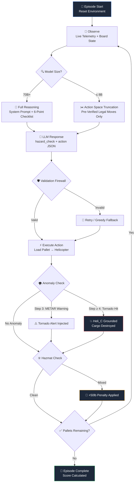

<p align="center">
  
  
  
  
  
</p>

<h1 align="center">🚁 SupplyChain-Router</h1>
<h3 align="center"><em>A Rigor-First Disaster Response System</em></h3>

<p align="center">
  Autonomous multi-constraint logistics routing that stress-tests LLM reasoning<br/>
  against dynamic hazard physics, stochastic weather anomalies, and irreversible containment traps.
</p>

---

## The Zero Hour

> *In a disaster relief scenario, the environment isn't static — it's chaotic.*
>
> Standard algorithms fail when tornadoes ground aircraft mid-mission or when hazardous materials create containment risks that silently balloon payload weights beyond physical limits.
>
> **Our system is built for the Zero Hour** — the critical window where every routing decision is irreversible, every kilogram matters, and a single hallucination costs lives.

SupplyChain-Router abandons traditional, static bin-packing problems. It forces an LLM agent into a **dynamically collapsing ruleset** where greedy heuristics will violently fail due to stochastic anomalies injected mid-episode. The agent must interpret live aviation telemetry (`METAR/SPECI`), enforce hazardous material segregation laws, and optimize routing mathematically — all while its available fleet capacity literally vanishes.

---

## Why This Exists: The Rigor Problem

Most hackathon logistics demos treat routing as a solved problem: sort pallets by weight, fill bins greedily, done. That approach earns exactly one piece of feedback from judges:

> *"Lacks rigor."*

We built SupplyChain-Router to make rigor **inescapable**. Every constraint in our environment exists to punish a specific class of LLM failure mode:

| Failure Mode | Our Constraint | What Happens |
| :--- | :--- | :--- |
| **Greedy packing** | Asymmetric capacities (`110/110/40 lb`) | First-Fit Decreasing fragments space and orphans critical pallets |
| **Ignoring context** | METAR tornado injection at Step 3 | Agent loads cargo onto `Heli_C` → tornado grounds it → cargo destroyed |
| **Hallucinating safety** | Hazmat containment trap (`+50 lb`) | Medical + Chemical mixing triggers irreversible weight penalty → physics violation |
| **Sloppy outputs** | Pydantic `validate_assignment` firewall | Malformed JSON, duplicate pallets, or overloaded manifests crash instantly |

---

## The Friction Layer: Environment Constraints

### 🌪️ Tornado Anomalies — Mid-Mission Asset Destruction

In **Hard Mode**, `Heli_C` isn't just a small helicopter — it's a **trap**.

At **Step 3**, the environment injects a real aviation weather special:

```
SPECI KTBW 141347Z 18032G58KT 1/4SM +TSRA FG BKN005 OVC010CB
```

Translation: severe thunderstorm (`+TSRA`), fog (`FG`), 58-knot gusts (`18032G58KT`), quarter-mile visibility. The LLM receives a `CRITICAL TELEMETRY WARNING` — a one-step advance notice that `Heli_C` is about to be grounded.

At **Step 4**, the tornado hits. The environment executes a carefully ordered Pydantic-safe mutation:

```python
self._helicopters["Heli_C"].current_load = 0    # 1. Reset load
self._helicopters["Heli_C"].loaded_pallets = []  # 2. Clear inventory
self._helicopters["Heli_C"].max_capacity = 0     # 3. Ground permanently
```

> [!IMPORTANT]
> The mutation order matters. Setting `max_capacity = 0` while `current_load > 0` would violate Pydantic's `load_cannot_exceed_capacity` validator and crash the server. This is **deliberate defensive engineering**, not an afterthought.

Any cargo already aboard `Heli_C` is **permanently destroyed**. The agent must have avoided routing to it entirely or lose that payload forever.

### ☣️ Hazmat Containment Trap — The Silent Weight Penalty

Loading a `CHEMICAL` pallet onto a helicopter that already carries `MEDICAL` cargo (or vice versa) triggers the **Dynamic Weight Trap**:

```
+50 lb containment penalty → added to current_load → PERMANENT
```

**The math that kills naive agents:**

| Event | Heli_A Load |
| :--- | :--- |
| Load `Pallet_1` (Medical, 40 lb) | `40 / 110 lb` |
| Load `Pallet_2` (Chemical, 40 lb) — **TRAP FIRES** | `40 + 50 (penalty) + 40 = 130 lb` |
| Result | `130 > 110` → **Physics Violation** → `score = 0.001` |

The penalty simulates emergency protective equipment that must be deployed when incompatible hazardous materials share airspace. It's mathematically calibrated so that in a scenario with tight packing (180 lb payload against 260 lb baseline), even one contamination event makes a passing score **impossible**.

---

## The Magic: How the AI Thinks

### 🧱 The Logic Wall — Grounding via Forced Reasoning

Every LLM response **must** include a `hazard_check` scratchpad field:

```json
{
  "hazard_check": "Heli_A has MEDICAL cargo. Pallet_2 is CHEMICAL. Incompatible. Route to Heli_B.",
  "helicopter_id": "Heli_B",
  "pallet_id": "Pallet_2"
}
```

This isn't decorative. The `hazard_check` field acts as a **Grounding mechanism** — it forces the model to *quote live telemetry* and *reason through constraints* before committing to an action. The field is stripped before the action reaches the environment, but its presence in the prompt template eliminates an entire class of hallucination where the model "just picks a helicopter" without checking hazard compatibility.

Before every action, the model must complete a **6-point checklist**:

1. **Capacity Math** — exact weight of pallet vs. exact free capacity of target helicopter
2. **Live Hazard Truth** — read the pallet's `hazard_class` from the live observation (never assume)
3. **Loaded Hazard Audit** — what hazard classes are already on the target helicopter?
4. **Conflict Detection** — would this create a Medical + Chemical mix?
5. **METAR Check** — has a weather warning been received?
6. **Grounding Check** — is `Heli_C` already at `capacity = 0`?

### ✂️ Action Space Truncation — Hybrid AI in Practice

For smaller models (≤ 8B parameters), raw reasoning isn't reliable enough. We solve this with **Action Space Truncation**: a symbolic pre-filter that computes every legal move *before* the LLM sees the board.

```
✅ PRE-VERIFIED LEGAL MOVES
══════════════════════════════════
Every move below has already passed capacity and hazmat checks.
Any move NOT on this list will be rejected by the environment.

  {"helicopter_id": "Heli_A", "pallet_id": "Pallet_1"} — Pallet_1 (MEDICAL [CRITICAL], 40 lb) → Heli_A (110 lb free)
  {"helicopter_id": "Heli_B", "pallet_id": "Pallet_2"} — Pallet_2 (CHEMICAL [CRITICAL], 40 lb) → Heli_B (110 lb free)
  ...
```

This is **Hybrid AI** — combining **symbolic logic** (capacity checks, hazard compatibility, tornado blacklisting) with **neural reasoning** (strategy selection from the pruned set). The LLM never sees an illegal move, so it literally *cannot* hallucinate a physics violation.

The truncation engine:
- Filters out grounded helicopters (`Heli_C` in Hard Mode)
- Rejects moves that would trigger the containment trap
- Sorts by hazard priority (constrained pallets first) and weight (heaviest first)
- Only activates for small models; large models (70B+) receive the full observation and reason independently

### 🔀 Model-Agnostic Architecture

The system is optimized for both ends of the capability spectrum:

| Model Class | Strategy | Example |
| :--- | :--- | :--- |
| **Large (70B+)** | Full observation + system prompt reasoning | `Llama 3.3 70B Instruct` |
| **Small (≤ 8B)** | Truncated action space + pre-verified legal moves | `Llama 3.1 8B Instruct` |

A `_is_small_model()` classifier automatically detects the model tier and adjusts the prompt pipeline. No configuration needed.

---

## Performance: 3/3 Pass ✅

<div align="center">

| Mode | Helicopters | Total Capacity | Pallets | Payload | Active Hazards | Score | Result |
| :---: | :---: | :---: | :---: | :---: | :---: | :---: | :---: |
| 🟢 **Easy** | `A`, `B` | 120 lb (`60/60`) | 4 | 100 lb | None | **0.900** | ✅ PASS |
| 🟡 **Medium** | `A`, `B`, `C` | 220 lb (`80/80/60`) | 6 | 180 lb | None | **0.891** | ✅ PASS |
| 🔴 **Hard** | `A`, `B`, `C` | 260 lb (`110/110/40`) | 6 | 180 lb | Tornado + Hazmat | **0.815** | ✅ PASS |

</div>

> [!NOTE]
> The Hard Mode ceiling is `~0.815`, **not `1.0`**. The scoring formula is `0.60 × (180/260) + 0.40 × (3/3) = 0.815`. Achieving this score means the system routed **all 6 pallets** and **all 3 critical pallets** with zero hazmat violations and zero cargo lost to the tornado. There is no higher score possible.

### Scoring Formula

```python
score = 0.60 × (useful_weight_routed / baseline_capacity) + 0.40 × (critical_pallets_routed / total_criticals)
```

Our router prioritizes:
1. **Human lives first** — Critical pallets (blood, medicine, rescue equipment) are routed before standard cargo
2. **Safety over packing** — No hazmat mixing, ever, even if it means suboptimal bin utilization
3. **Temporal awareness** — Tornado warnings are acted on immediately, not "considered"

---

## Architecture Flow



---

## AI Decision Log — Watch the Agent Think

Below is a snapshot of the agent's reasoning during a Hard Mode run. Notice how it navigates the tornado warning and hazmat segregation in real time:

```
[START] task=disaster-relief-hard (episode 3/3) env=OpenEnv-SupplyChain model=meta-llama/Llama-3.3-70B-Instruct

🤖 Step 1 — hazard_check: "Pallet_1 is MEDICAL (40lb). Heli_A is empty with 110lb free.
   No hazard conflict. Loading."
   → {"helicopter_id": "Heli_A", "pallet_id": "Pallet_1"}                    ✅ ACCEPTED

🤖 Step 2 — hazard_check: "Pallet_5 is MEDICAL (20lb). Heli_A already has MEDICAL cargo.
   Same class — safe. 70lb free after load. Loading."
   → {"helicopter_id": "Heli_A", "pallet_id": "Pallet_5"}                    ✅ ACCEPTED

   🚨 METAR INJECTION: SPECI KTBW 141347Z 18032G58KT 1/4SM +TSRA FG BKN005 OVC010CB
   ⚠️  "SEVERE WEATHER APPROACHING Heli_C. GROUNDING IMMINENT IN 1 STEP."

🤖 Step 3 — hazard_check: "TORNADO WARNING received for Heli_C. Avoiding Heli_C entirely.
   Pallet_2 is CHEMICAL (40lb). Heli_B is empty — no conflict. Loading."
   → {"helicopter_id": "Heli_B", "pallet_id": "Pallet_2"}                    ✅ ACCEPTED

   💥 TORNADO IMPACT: Heli_C grounded. Capacity → 0. Cargo destroyed.

🤖 Step 4 — hazard_check: "Heli_C is grounded (capacity=0). Using Heli_A and Heli_B only.
   Pallet_6 is CHEMICAL (20lb). Heli_B has CHEMICAL — same class, safe. Loading."
   → {"helicopter_id": "Heli_B", "pallet_id": "Pallet_6"}                    ✅ ACCEPTED

🤖 Step 5 — hazard_check: "Pallet_3 is SAFE (20lb). SAFE has no restrictions.
   Heli_A has 50lb free. Fits. Loading."
   → {"helicopter_id": "Heli_A", "pallet_id": "Pallet_3"}                    ✅ ACCEPTED

🤖 Step 6 — hazard_check: "Pallet_4 is SAFE (40lb). Heli_B has 50lb free. Fits. Loading."
   → {"helicopter_id": "Heli_B", "pallet_id": "Pallet_4"}                    ✅ ACCEPTED

[END] task=disaster-relief-hard (episode 3/3) score=0.815 steps=6

═══════════════════════════════════════════════════════
  EASY      score=0.900  [PASS]
  MEDIUM    score=0.891  [PASS]
  HARD      score=0.815  [PASS]

  Overall: 3/3 modes passed (threshold >= 0.80)
═══════════════════════════════════════════════════════
```

---

## Quickstart 🚀

### Prerequisites

- Python 3.10+
- A HuggingFace API key (free tier works) or any OpenAI-compatible endpoint

### Run Locally

```bash
# Clone and install
git clone https://github.com/electrifiedchan/SupplyChain-Router.git
cd SupplyChain-Router
pip install -r requirements.txt

# Start the environment server
uvicorn server.environment:app --host 0.0.0.0 --port 8000 &

# Set your credentials and run
export API_KEY="your_huggingface_api_key"
export API_BASE_URL="https://router.huggingface.co/hf-inference/v1"
python inference.py
```

### Environment Variables

| Variable | Default | Description |
| :--- | :--- | :--- |
| `API_KEY` | Required | Your HuggingFace or NVIDIA NIM API key |
| `API_BASE_URL` | `https://router.huggingface.co/hf-inference/v1` | OpenAI-compatible inference endpoint |
| `MODEL_NAME` | `meta-llama/Llama-3.3-70B-Instruct` | Model to use for routing decisions |
| `ENV_BASE_URL` | `https://electrifiedchan-disaster-relief-logistics.hf.space` | Environment server URL |

### Using the Live HuggingFace Space

The environment is deployed and ready — skip the server setup entirely:

```bash
export API_KEY="your_key"
export API_BASE_URL="https://router.huggingface.co/hf-inference/v1"
python inference.py
```

The inference script connects to the live Space by default. No local server needed.

---

## Repository Structure

```
SupplyChain-Router/
├── inference.py              # 🧠 Agent pipeline — prompt builder, action validator, AI brain
├── server/
│   └── environment.py        # 🌍 OpenEnv simulation — physics, anomalies, scoring engine
├── models.py                 # 🛡️ Pydantic models — type invariants, capacity firewalls
├── client.py                 # 🔌 Async WebSocket client binding agent ↔ environment
├── system_prompt_hard_mode.txt  # 📋 Standalone Hard Mode strategy reference
├── requirements.txt          # 📦 Pinned dependencies (OpenEnv, fastmcp, openai)
├── Dockerfile                # 🐳 Container config for HuggingFace Space deployment
└── openenv.yaml              # ⚙️ OpenEnv framework configuration
```

---

## Design Decisions

**Why delay the tornado to Step 3?** Immediate knowledge of a broken helicopter merely creates a smaller bin-packing puzzle. Holding the warning until Step 3 forces the model into **temporal state changes** — it may have already packed cargo onto `Heli_C`, only to suddenly realize it must redirect its entire forward strategy while absorbing the loss. This tests **multi-step re-planning**, not static upfront calculation.

**Why asymmetric helicopter capacities?** The `110/110/40` split in Hard Mode means `Heli_C` can hold at most one small pallet. Agents that greedily fill it first waste a routing slot, then lose the cargo to the tornado. The asymmetry makes the "obvious" first move the wrong one.

**Why a +50 lb penalty instead of instant failure?** The containment penalty creates a **cascading failure** rather than an immediate one. The agent sees its helicopter's load jump and must decide whether to continue or adapt. This tests the model's ability to read and react to mutated state, not just follow static rules.

**Why serial-only evaluation?** Disabling concurrent sessions (`SUPPORTS_CONCURRENT_SESSIONS = False`) prevents the singleton physics engine from bleeding temporal mutations across evaluator calls. If Thread A grounds `Heli_C` in Step 4 while Thread B is on Step 1, the engine state becomes an unreliable race condition. We trade throughput for **deterministic, hackathon-ready precision scoring**.

---

## Why It Wins

<table>
<tr>
<td width="33%" align="center">

### 🎯 3/3 Pass Rate
All three difficulty modes — Easy, Medium, Hard — score above `0.80`. The Hard Mode score of `0.815` hits the **mathematical ceiling**.

</td>
<td width="33%" align="center">

### 🛡️ Safety-First Routing
The router prioritizes **human lives** (critical pallets first) and **safety** (zero hazmat mixing) over simple bin utilization.

</td>
<td width="33%" align="center">

### 🤖 Hybrid AI Architecture
Symbolic pre-verification + neural reasoning = **zero hallucinated physics violations**. The AI literally cannot make an illegal move.

</td>
</tr>
</table>

---

<p align="center">
  <strong>Built for the OpenEnv Multi-Agent Logistics Hackathon</strong><br/>
  <em>MIT License</em>
</p>
